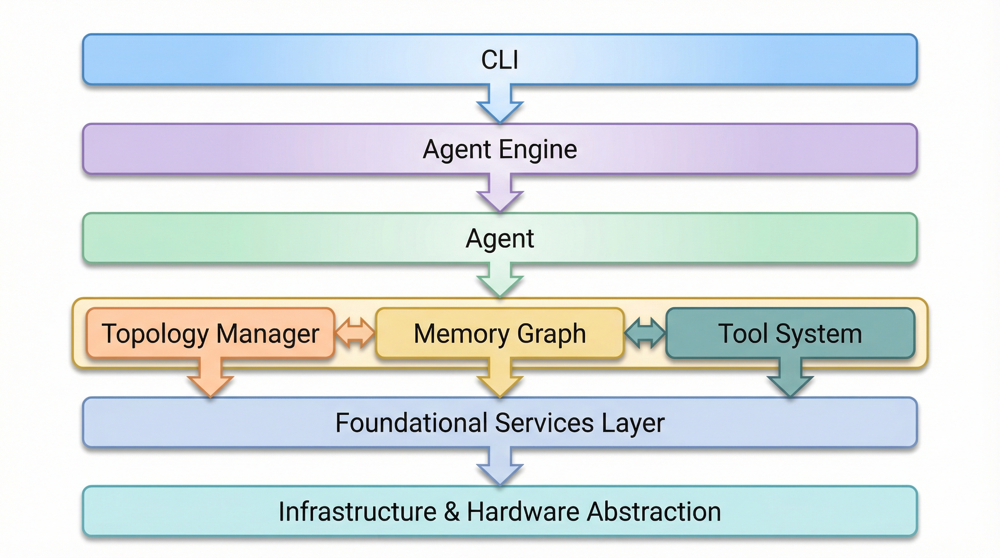
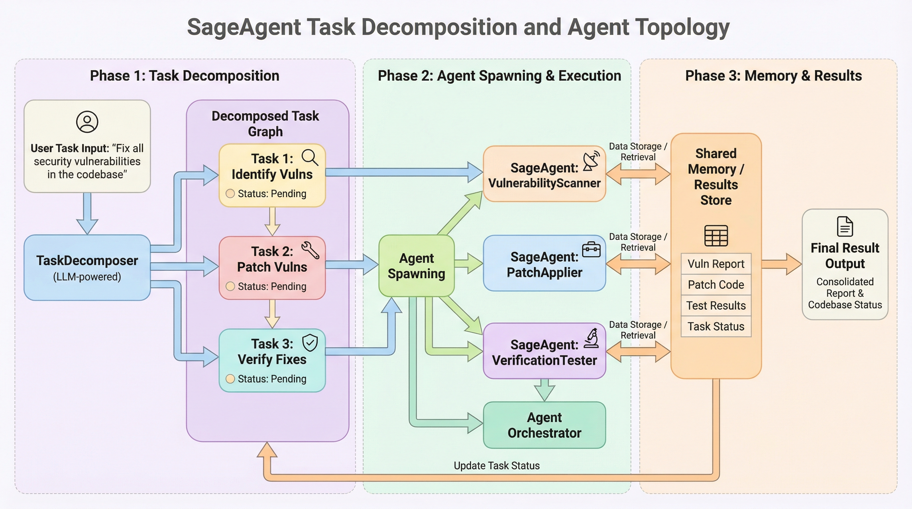
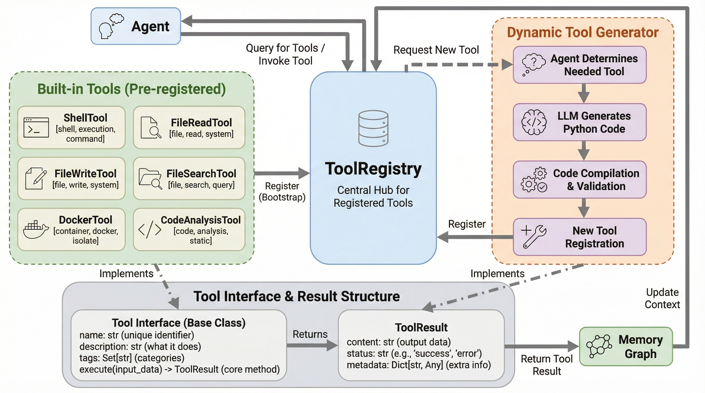
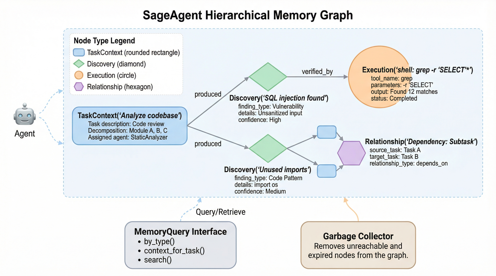

# SageAgent

Open-source implementation of the [OpenSage whitepaper](https://arxiv.org/abs/2602.16891) — a Self-Programming Agent Generation Engine where AI systems self-design their operational components.

SageAgent is an **Agent Development Kit (ADK)** with self-generated topology, dynamic toolsets, and hierarchical graph-based memory.

> **Video overview:** [Stop coding AI: Use Runtime Topological Self-Assembly](https://www.youtube.com/watch?v=nSTednV1uTA) — an explainer covering how OpenSage uses discrete topological symbolic graphs for multi-agent self-assembly and mathematical optimization.



## Features

- **Self-Generated Topology** — LLM-driven task decomposition into DAGs with automatic sub-agent spawning
- **Dynamic Tool Generation** — Runtime tool creation via LLM with validation and sandboxed execution
- **Hierarchical Memory Graph** — NetworkX DAG storing task context, discoveries, and execution traces with automatic garbage collection
- **Pluggable LLM Backends** — Claude (Anthropic) and OpenAI with a common async interface
- **Agent Communication Bus** — Pub/sub message bus for loosely-coupled agent coordination
- **Built-in Tools** — Shell execution, file operations, code analysis, and Docker sandboxing
- **100% Test Coverage** — 217 tests with full line and branch coverage, enforced by pre-commit hooks

## Quick Start

### Installation

```bash
# Clone the repository
git clone https://github.com/ianblenke/sageagent.git
cd sageagent

# Install with dev dependencies
pip install -e ".[dev]"
```

### Set your API key

```bash
# For Claude (default)
export ANTHROPIC_API_KEY="your-key-here"

# Or for OpenAI
export OPENAI_API_KEY="your-key-here"
```

### Run a task

```bash
# Simple single-agent execution
sageagent run "Analyze the Python files in the current directory and list all classes"

# With task decomposition (spawns sub-agents)
sageagent run "Refactor the auth module and update its tests" --decompose

# Using OpenAI backend
sageagent run "Write a utility function for parsing CSV" --backend openai

# Show current configuration
sageagent config
```

### CLI Reference

```
sageagent run <TASK> [OPTIONS]

Options:
  -b, --backend TEXT     LLM backend: claude or openai (default: claude)
  -m, --model TEXT       Model name override
  -d, --decompose        Use topology manager for task decomposition
  --max-depth INTEGER    Maximum agent hierarchy depth (default: 5)
  -t, --timeout INTEGER  Tool execution timeout in seconds (default: 120)
```

## Usage Examples

### Basic: Run a single agent

```python
import asyncio
from sageagent import AgentEngine, EngineConfig

async def main():
    config = EngineConfig(
        llm_backend="claude",
        anthropic_api_key="your-key-here",
    )
    engine = AgentEngine(config)

    result = await engine.run("List all Python files and count the total lines of code")
    print(result)

    await engine.shutdown()

asyncio.run(main())
```

### Task Decomposition with Sub-Agents

The topology manager automatically breaks complex tasks into subtasks, builds a dependency DAG, and spawns sub-agents to execute them in parallel.

```python
import asyncio
from sageagent import AgentEngine, EngineConfig

async def main():
    engine = AgentEngine(EngineConfig(
        llm_backend="claude",
        anthropic_api_key="your-key-here",
        agent={"max_hierarchy_depth": 3},
    ))

    # The engine decomposes this into subtasks and runs them concurrently
    result = await engine.run_with_topology(
        "Analyze the project structure, find all TODO comments, "
        "and generate a summary report"
    )
    print(result)
    await engine.shutdown()

asyncio.run(main())
```



### Custom Tools

Create domain-specific tools by subclassing `Tool`:

```python
import asyncio
from sageagent import AgentEngine, EngineConfig
from sageagent.tools.base import Tool, ToolResult

class DatabaseQueryTool(Tool):
    @property
    def name(self) -> str:
        return "db_query"

    @property
    def description(self) -> str:
        return "Execute a read-only SQL query against the application database"

    @property
    def parameters_schema(self) -> dict:
        return {
            "type": "object",
            "properties": {
                "query": {"type": "string", "description": "SQL SELECT query"},
            },
            "required": ["query"],
        }

    @property
    def tags(self) -> list[str]:
        return ["database", "sql", "read"]

    async def execute(self, **kwargs) -> ToolResult:
        query = kwargs.get("query", "")
        if not query.strip().upper().startswith("SELECT"):
            return ToolResult(
                output="", status="error",
                metadata={"error": "Only SELECT queries allowed"},
            )
        # Your database logic here
        rows = [{"id": 1, "name": "example"}]
        return ToolResult(output=str(rows), metadata={"row_count": len(rows)})

async def main():
    engine = AgentEngine(EngineConfig.from_env())

    # Register the custom tool
    engine.tools.register(DatabaseQueryTool())

    result = await engine.run("How many users signed up this month?")
    print(result)
    await engine.shutdown()

asyncio.run(main())
```



### Dynamic Tool Generation

Let the LLM generate tools at runtime based on task requirements:

```python
import asyncio
from sageagent.core.config import EngineConfig
from sageagent.core.engine import AgentEngine
from sageagent.tools.generator import DynamicToolGenerator

async def main():
    engine = AgentEngine(EngineConfig.from_env())

    generator = DynamicToolGenerator(engine._llm, engine.tools)

    # The LLM writes a tool class, validates it, and registers it
    tool = await generator.generate(
        "A tool that converts temperatures between Celsius and Fahrenheit"
    )
    print(f"Generated tool: {tool.name}")
    print(f"Registered tools: {[t.name for t in engine.tools.list_tools()]}")

    await engine.shutdown()

asyncio.run(main())
```

### Memory Graph

The memory system stores all agent activity in a DAG. Nodes represent task context, discoveries, and tool executions. Edges encode relationships between them.

```python
from sageagent.memory.graph import MemoryGraph
from sageagent.memory.node import (
    MemoryNode, NodeType,
    TaskContextPayload, DiscoveryPayload, ExecutionPayload,
)
from sageagent.memory.query import MemoryQuery
from sageagent.core.types import NodeId

# Create a memory graph
graph = MemoryGraph()

# Add a task context node
task_node = MemoryNode(
    node_type=NodeType.TASK_CONTEXT,
    payload=TaskContextPayload(
        task_description="Analyze authentication module",
        assigned_agent="agent-001",
    ),
)
graph.add_node(task_node)

# Add a discovery linked to the task
discovery = MemoryNode(
    node_type=NodeType.DISCOVERY,
    payload=DiscoveryPayload(
        finding_type="vulnerability",
        details="SQL injection in login endpoint",
        confidence=0.95,
    ),
)
graph.add_node(discovery)
graph.add_edge(task_node.id, discovery.id, label="discovered")

# Query the memory
query = MemoryQuery(graph)
findings = query.by_type(NodeType.DISCOVERY)
print(f"Findings: {len(findings)}")

context = query.context_for_task(task_node.id)
print(f"Task context nodes: {len(context)}")

results = query.search("SQL injection")
print(f"Search hits: {len(results)}")

# Garbage collect old nodes
removed = graph.garbage_collect(active_root_ids={task_node.id})
print(f"GC removed {removed} unreachable nodes")
```



### Message Bus

Agents coordinate through a pub/sub message bus:

```python
import asyncio
from sageagent.communication.bus import MessageBus
from sageagent.communication.protocols import (
    MessageType, TaskCompleted, TaskFailed,
)
from sageagent.core.types import AgentId, TaskId

bus = MessageBus()

# Subscribe to specific message types
async def on_complete(msg: TaskCompleted):
    print(f"Agent {msg.sender} completed task: {msg.payload}")

async def on_failure(msg: TaskFailed):
    print(f"Agent {msg.sender} failed: {msg.error}")

bus.subscribe(MessageType.TASK_COMPLETED, on_complete)
bus.subscribe(MessageType.TASK_FAILED, on_failure)

# Or subscribe to everything
async def audit_log(msg):
    print(f"[{msg.type}] {msg.sender} at {msg.timestamp}")

bus.subscribe_all(audit_log)

# Publish events
async def main():
    await bus.publish(TaskCompleted(
        sender=AgentId("agent-001"),
        task_id=TaskId("task-abc"),
        payload={"result": "Analysis complete"},
    ))

    # Review history
    history = bus.get_history(MessageType.TASK_COMPLETED)
    print(f"Completed tasks: {len(history)}")

asyncio.run(main())
```

### Configuration

SageAgent is configured via `EngineConfig` or environment variables:

```python
from sageagent import EngineConfig

# Explicit configuration
config = EngineConfig(
    llm_backend="claude",
    anthropic_api_key="sk-ant-...",
    model_name="claude-sonnet-4-20250514",
    agent={"max_iterations": 20, "max_hierarchy_depth": 3},
    tools={
        "execution_timeout_seconds": 60,
        "docker_enabled": True,
        "docker_image": "python:3.11-slim",
        "docker_memory_limit": "256m",
        "working_directory": "/workspace",
    },
    memory={"max_age_seconds": 7200},
)

# Or load from environment
# Reads ANTHROPIC_API_KEY and OPENAI_API_KEY automatically
config = EngineConfig.from_env()
```

**Environment variables:**

| Variable | Description |
|----------|-------------|
| `ANTHROPIC_API_KEY` | Anthropic API key (selects Claude backend) |
| `OPENAI_API_KEY` | OpenAI API key (selects OpenAI backend) |

## Architecture

SageAgent is built around five core capabilities from the OpenSage whitepaper:

| Capability | Module | Description |
|-----------|--------|-------------|
| Agent Engine | `sageagent.core` | Agent lifecycle, configuration, top-level orchestration |
| Topology Manager | `sageagent.topology` | Task decomposition into DAGs, sub-agent spawning |
| Toolset Generator | `sageagent.tools` | Tool registry, dynamic generation, built-in tools |
| Memory Graph | `sageagent.memory` | DAG-based memory with typed nodes and GC |
| Agent Communication | `sageagent.communication` | Message bus with pub/sub protocols |

### Package Structure

```
sageagent/
├── core/
│   ├── agent.py          # Agent with iterative LLM+tool execution loop
│   ├── engine.py         # Top-level orchestrator wiring all components
│   ├── config.py         # Pydantic configuration models
│   └── types.py          # Shared types (AgentId, TaskId, NodeId, enums)
├── llm/
│   ├── base.py           # Abstract LLMBackend interface
│   ├── claude.py         # Anthropic Claude backend
│   └── openai.py         # OpenAI GPT backend
├── memory/
│   ├── graph.py          # NetworkX DAG with cycle detection and GC
│   ├── node.py           # Typed nodes with Pydantic payloads
│   └── query.py          # Graph traversal and search
├── tools/
│   ├── base.py           # Tool ABC and ToolResult
│   ├── registry.py       # Tool registration and discovery
│   ├── generator.py      # LLM-driven tool generation
│   └── builtins/         # Shell, file ops, code analysis, Docker
├── communication/
│   ├── bus.py            # Async pub/sub message bus
│   └── protocols.py      # Message types and schemas
├── topology/
│   ├── dag.py            # TaskDAG with dependency tracking
│   ├── decomposer.py     # LLM-driven task decomposition
│   └── manager.py        # Hierarchical agent execution
└── cli.py                # Typer CLI entry point
```

## Development

### Setup

```bash
pip install -e ".[dev]"
pre-commit install
```

### Run tests

```bash
# Full suite with coverage (must hit 100%)
pytest

# Specific module
pytest tests/memory/ -v

# With verbose output
pytest --tb=long -v
```

### Pre-commit hooks

The project enforces quality via four pre-commit hooks:

1. **black** — Code formatting (line length 100)
2. **ruff** — Linting (E/W/F/I/UP/B/SIM rules)
3. **gitleaks** — Secret detection
4. **pytest** — Full test suite with 100% coverage gate

```bash
# Run all hooks manually
pre-commit run --all-files
```

### Code style

- **Formatter:** Black (line length 100)
- **Linter:** Ruff
- **Type hints** on all public APIs
- **100% test coverage** (line + branch), enforced in CI and pre-commit

## Dependencies

| Package | Purpose |
|---------|---------|
| `anthropic` | Claude API client |
| `openai` | OpenAI API client |
| `networkx` | Graph-based memory DAG |
| `pydantic` | Data validation and configuration |
| `typer` | CLI framework |
| `docker` | Container sandboxing |

## License

MIT
